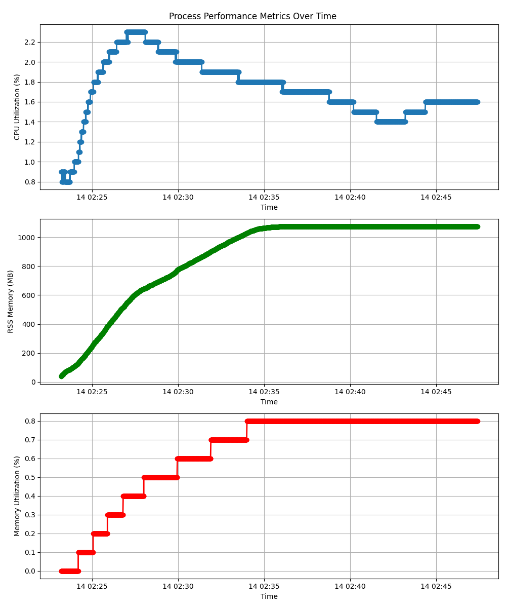

# Hotline

## Overview

This project develops a front-end for memory profiling using the ARM Statistical Profiling Extension (SPE), designed for integration with APerf or as a standalone tool. The tool provides detailed memory access analysis including latency measurements, cache hierarchy completion node distributions, and branch statistics.

**Key Features:**
- Memory hotspot analysis with cycle-accurate latency measurements
- Completion node analysis (L1/L2/L3/DRAM completion node distribution)
- Low system overhead with configurable sampling rates
- Real-time profiling with aggregated results

**Architecture:**
- Uses ARM SPE hardware sampling for precise memory access tracking
- Context switch mapping for multi-process environments
- B-Tree-based aggregation
- Configurable sampling period and wakeup period

### File Structure
```
.
├── bmiss_map.c/h           -- SPE branch misprediction maps
├── btree.c/h               -- B-Tree data structure
├── config.c/h              -- User argument handling
├── finode_map.c/h          -- File inode information to file name mapping
├── fname_binary_map.c/h    -- File name to debug information
├── fname_map.c/h           -- File name to virtual address mapping for address translation
├── hotline.c/h             -- Perf event setup, main loop, and serialization
├── lat_map.c/h             -- SPE latency maps
├── log.h                   -- Error handling utilities
├── perf_interface.h        -- Perf structures for record and aux buffer
├── report.c/h              -- Deserialization of lat and bmiss maps
├── sys.c/h                 -- Reads system files for later configuration
├── tests                   -- Unit and sanity tests
├── vec.c/h                 -- Vector implementation
```

### Adding New Views
1. Create in-memory data structure for view
2. Add parsing and updating logic for it during main event loop
3. Update report to read new view data and generate report for it

## Validation

### Microbenchmarks
- **STREAM Benchmark**: Successfully identifies all four expected hotspots (copy, scale, add, triad operations)
- **lat_mem_rd**: Validates latency accuracy across different buffer sizes, correlating with expected memory hierarchy latencies
- **lh_ticket_spinlock**: Confirms correct latency measurement under lock contention scenarios

### Real-world Applications
- **RocksDB**: Detected 13% latency improvement from prefetching optimization patch
- **Video Encoder (sv1-avt)**: Identified performance-impacting NEON intrisics
- **Heterogeneous Workloads**: Successfully profiles concurrent DRAM-bound and L2-bound applications

### Validation Results
- Latency measurements align with hardware expectations
- Tool correctly identifies optimization opportunities in known patches

## System Usage

### Performance Overhead
- 2 - 4 parallel `sv1` processes were run. At the peak CPU utilization, the system had 2 `sv1` processes, and 2 `STREAM` processes.


## Future Improvements
- On serialization, write all B-Tree states directly into an mmap-able region, and on report generation read from there.
- Add more views